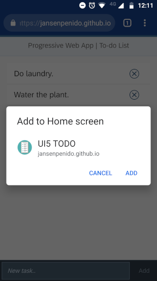
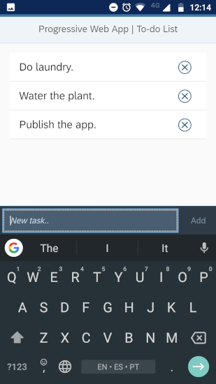

# UI5 PWA To-do List

### [Live Demo](https://jansenpenido.github.io/ui5-pwa-todo-list/webapp/index.html)

## Overview
A simple To-do List [Progressive Web App](https://developers.google.com/web/progressive-web-apps/) powered by [OpenUI5](https://openui5.org/) and Node.js.

Upon accessing the application from a touch device, you'll be prompted to add it to your home screen, so that it'll work just like a native mobile application, including full-screen interaction and offline support.

## Instructions

### Run locally (Node.js server)
1. Clone/download this repository.
1. Open the terminal and navigate to the repository's root directory.
1. Run the command `npm install` to download the necessary packages.
1. Run the command `node server.js` to start the app's server.
1. Open the browser and enter `http://localhost:8809/` to see the app.

## Acknowledgments
- The app 'clipboard' icon was designed by [Juliia Osadcha](https://juliiaosadcha.com/).
- This project was inspired by OpenUI5's official sample provided [here](https://github.com/SAP/openui5-pwa-sample). In order to improve the user experience, the project has been refactored according to the UI5's MVC standards and Fiori Guidelines.
